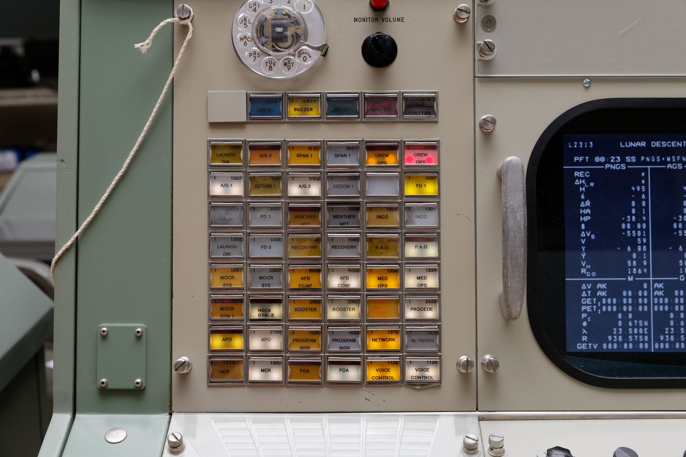
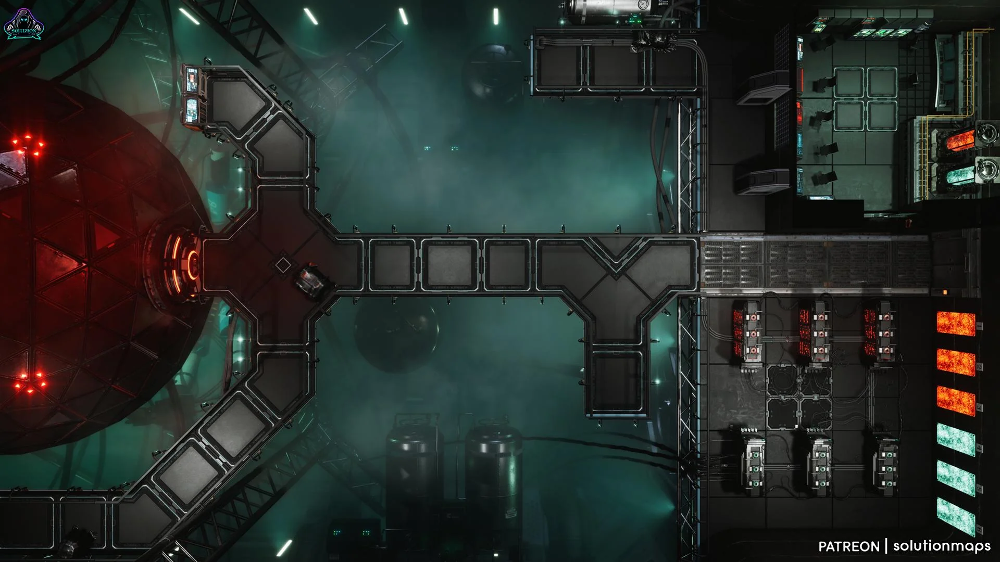

SUPSI 2026  
Corso d’interaction design, CV429.01  
Docenti: A. Gysin, G. Profeta  

Progetto 2: Un piccolo passo per un uomo, un grande balzo per l'umanità

# NASA70 Archive
Autore: Riccardo Vosti \
[NASA 70](https://github.com/ixd-supsi/2026/tree/main/esempi/es06_array_7)


## Introduzione e tema
Il progetto nasce con l'obiettivo di celebrare il 70° anniversario della NASA attraverso la creazione di uno spazio digitale interattivo. Non si tratta di un semplice catalogo lineare, ma di un vero e proprio ecosistema esplorativo progettato per accogliere una vasta collezione di progetti e documentazioni. La piattaforma trasforma l'utente da spettatore passivo a esploratore attivo, richiedendo un'interazione spaziale diretta per svelare i contenuti.
Il tema centrale del progetto è il parallelismo tra l'esplorazione dell'universo e l'esplorazione dello spazio digitale. Per bilanciare questa vastità senza generare caos visivo, l'interfaccia si fonda su un'estetica minimalista e rigorosa, di forte ispirazione Swiss International Style. L'utilizzo di una griglia rigida e inflessibile (la matrice 16x7) fa da scheletro all'intera esperienza, imponendo ordine e proporzione. La palette cromatica ad alto contrasto — dominata da neri profondi, grigi tecnici e accenti di rosso NASA — unita a una tipografia essenziale, riflette la precisione ingegneristica e strumentale che da sempre contraddistingue le missioni aerospaziali.


## Riferimenti progettuali
L'interfaccia si ispira alle sale di controllo NASA degli anni '70, trasformando il sito in una vera stazione di monitoraggio dati.

Matrice come Strumentazione: La griglia 16x7 richiama i grandi schermi dei centri di controllo dove ogni progetto funge da "stazione" da analizzare.

Esperienza Operativa: Navigare tramite zoom e trascinamento trasforma l'utente in un operatore di missione, rendendo la consultazione dei contenuti un atto di esplorazione attiva e non passiva. 

[]()


## Design dell’interfaccia e modalità di interazione
Una mappa da esplorare, non una pagina da scorrere
Invece del classico scorrimento verticale dall'alto verso il basso, il sito è progettato come un'ampia tela navigabile. Tutti i progetti sono organizzati in una griglia 16x7 ordinata e geometrica. L'idea è quella di dare all'utente la sensazione di muoversi liberamente su una mappa interattiva o su un monitor di navigazione.  Colori essenziali e atmosfera spaziale
L'estetica del sito va dritta al punto: lo sfondo è nero profondo e i testi sono chiari. L'unico colore che spicca veramente è il rosso ufficiale della NASA, che viene usato solo per indicare gli elementi interattivi, come i bottoni o le schede selezionate. È un look molto pulito che ricorda i vecchi terminali delle sale di controllo spaziali.  I caratteri giusti per i dati giusti
Per i testi ho usato solo due tipi di carattere:  Un font pulito e moderno (Inter) per i titoli e le descrizioni, per garantire la massima facilità di lettura.Un font in stile "macchina da scrivere" (Roboto Mono) per le date, i tag e i metadati, scelto appositamente per dare al sito l'aspetto di un vero archivio scientifico.  Tutto in una sola schermata
Per mantenere l'esperienza fluida, quando si clicca su un progetto non si viene mai mandati su un'altra pagina. Si apre semplicemente un pannello laterale che sposta delicatamente la griglia, permettendo di leggere i dettagli senza perdere mai il punto in cui ci si trovava. Anche i piccoli dettagli seguono questa logica interattiva: ad esempio, il logo NASA nel menu non è una semplice immagine, ma un piccolo "gioco" di pixel luminosi che reagisce al passaggio del mouse.  

<video width="320" height="240" controls loop="" muted="" autoplay="">
    <source src="https://github.com/RiccardoVosti/NASA70/blob/main/imgs/website.mp4" />
</video>

[]()


## Tecnologia usata
HTML5 & CSS3: Utilizzati per definire la struttura semantica della pagina e per gestire l'intero sistema di griglia (matrice 16x7) tramite il modulo CSS Grid.

JavaScript: Ho preferito l'uso di JavaScript puro per mantenere il codice leggero e performante, senza il sovraccarico di framework pesanti. Il linguaggio gestisce:

La dinamica di zoom e pan (spostamento) sulla griglia.

Il sistema di filtraggio dei progetti in tempo reale.

La logica dell'animazione per il logo interattivo.

Google Fonts: Utilizzato per integrare i font Inter e Roboto Mono.

JSON: Per raccogliere i vari progetti a tal modo di creare un CMS con i progetti, un metodo semplice per poi aggiungerne altri.


```JavaScript
function initNasaLogo(containerId) {
    const sequences = [
        '111101101', '010111101', '011010110', '010111101', '111011100', '111101111'
    ];
    
    const container = document.getElementById(containerId);
    if (!container) return;

    sequences.forEach(seq => {
        const letterGrid = document.createElement('div');
        letterGrid.className = 'logo-letter';
        for (let char of seq) {
            const block = document.createElement('div');
            block.className = 'logo-block';
            if (char === '1') block.classList.add('is-white');
            letterGrid.appendChild(block);
        }
        container.appendChild(letterGrid);
    });

    const whiteBlocks = Array.from(container.querySelectorAll('.logo-block.is-white'));
    let snakeIndex = 0;

    function runSnake() {
        if (snakeIndex < whiteBlocks.length) {
            whiteBlocks[snakeIndex].classList.add('is-snake');
            if (snakeIndex > 0) whiteBlocks[snakeIndex - 1].classList.remove('is-snake');
            snakeIndex++;
            setTimeout(runSnake, 60); 
        } else {
            whiteBlocks[snakeIndex - 1].classList.remove('is-snake');
            setTimeout(() => {
                snakeIndex = 0;
                runSnake();
            }, 2500); 
        }
    }
    setTimeout(runSnake, 1000);
};
image.src = url;
```

## Target e contesto d’uso
Il target di riferimento principale è costituito da utenti tra i 15 e i 30 anni, appassionati dello spazio e della NASA, alla ricerca di un'esperienza divulgativa interattiva. Tuttavia, il vero filtro d'accesso all'archivio non è l'età anagrafica, bensì l'alfabetizzazione digitale: l'interfaccia richiede una certa familiarità con i pattern di navigazione web contemporanei (zoom, drag & pan). Questo rende l'esperienza pienamente accessibile a chiunque — indipendentemente dall'età — possieda la giusta dimestichezza con l'esplorazione digitale.

[]()
